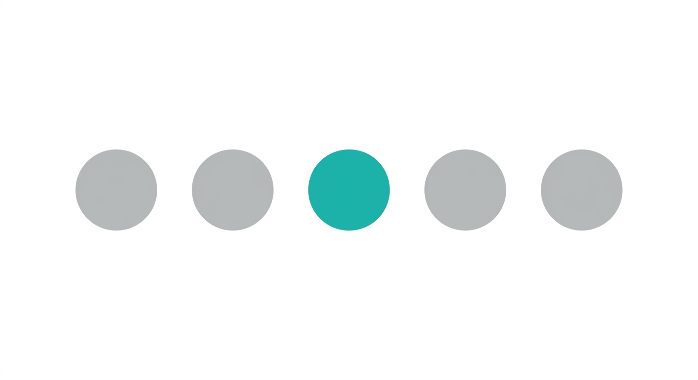

<p align="center">
  
</p>

<h1 align="center">Pager Dots</h1>

<p align="center">
  A minimal virtual desktop switcher for the KDE Plasma panel.<br>
  A dot marks the current desktop, dimmed labels show the rest.
</p>

<p align="center">
  
</p>
&nbsp;
<p align="center">
  
</p>
&nbsp;
<p align="center">
  
</p>
&nbsp;
<p align="center">
  
</p>
&nbsp;
<p align="center">
  
</p>
&nbsp;

## Install

### KDE Store (recommended)

1. Right-click the panel or desktop → **Add Widgets…**
2. **Get New Widgets…** → **Download New Plasma Widgets**
3. Search for **Pager Dots** → **Install**

Or open the store page directly: [Pager Dots on store.kde.org](https://store.kde.org/p/2370913/)

### One command

Grabs the latest release and installs it — safe to re-run, it upgrades an existing copy.

```sh
curl -fLo /tmp/pd.plasmoid "$(curl -s https://api.github.com/repos/Patruxs/pagerdots/releases/latest | grep -om1 'https[^"]*\.plasmoid')" &&
kpackagetool6 -t Plasma/Applet -i /tmp/pd.plasmoid 2>/dev/null || kpackagetool6 -t Plasma/Applet -u /tmp/pd.plasmoid
```

Needs `curl` and `kpackagetool6` (`kf6-kpackage` on Fedora, `kpackage` on Arch), normally already installed.

Then right-click the panel → **Add Widgets…**, search for **Pager Dots** and drag it onto the panel.
Run the same command again to update; restart Plasma afterwards to reload it:

```sh
systemctl --user restart plasma-plasmashell.service
```

To remove the widget:

```sh
kpackagetool6 -t Plasma/Applet -r pat.pagerdots
```

## Requirements

- KDE Plasma 6.2 or newer (Debian 13, Fedora 41+, Arch, Ubuntu 25.10+)
- KWin on X11 or Wayland

## Features

- A dot for the current desktop, a label for every other one
- 17 label styles: numbers, letters (A B C / a b c), roman numerals (I II III / i ii iii), Greek, Cyrillic, Chinese, Heavenly Stems, Hiragana, Katakana, Hangul, Arabic-Indic digits, bars (▁ ▂ ▃), dots, fill-up-to-current (● ● ○ ○), or blank
- 34 dot animations — stretch, glide, elastic, spring, hop, swing, lift, glow, ripple, footprints, ring, sparks, pour, drop, pop, fade, beam, split, flash, wrap, steps, boomerang, topple, cartwheel, arrow, train, twinkle, hoop, billiards, recoil, loop, volley, flip, burst — plus a speed slider, or none at all
- Dot in your text or accent colour, with adjustable spacing
- Click to switch, scroll or swipe to step through desktops (wraps around)
- Hover for the desktop name
- Horizontal and vertical panels, following your Plasma colour scheme and font

Right-click the widget → **Configure Pager Dots…** to change any of it; the preview at the top plays your choices live.

### Adding an animation

Each dot animation is one file in `contents/ui/animations/`; `Dot.qml` loads `animations/<Name>.qml` for the id `<name>` and calls its `start(old, target)` whenever the dot has to move. To add one:

1. Copy the closest existing file under a new name, say `Bounce.qml`. `Pop.qml` is the simplest swap, `Hop.qml` the simplest slide with a flourish on top, and `Boomerang.qml` the simplest of those that move the dot along the row themselves.
2. Set `kind` and, unless the default suits, `travel`; write `start()` to kick the animation off, and draw any shapes it needs as children. `animations/DotAnimation.qml` documents every hook and everything `dot` provides.
3. Add `{ id: "bounce", name: "Bounce", description: "…" }` to `MODES` in `contents/ui/Animations.js`, which puts it on the settings page and in the tests.
4. Run `tests/run`, then restart Plasma and try it in a panel, including switching desktops again while it is still in flight.

`start()` is called again if the desktop changes mid-move. A fresh start sets everything up from scratch (`setFrom(old)` and `dot.placeGhost(old)` before restarting the animation); a cut-in should carry on from where the shapes are, as the existing files do.

## Contributing

Bug reports and pull requests are welcome on [GitHub](https://github.com/Patruxs/pagerdots/issues). New animations are the easiest contribution: see [Adding an animation](#adding-an-animation) above, and keep in mind that on a dot a few pixels across only a distinct silhouette or tempo reads as a different animation.

## Support

If Pager Dots is useful to you, you can support development:

<p align="center">
  <a href="https://github.com/sponsors/Patruxs"></a>
  &nbsp;
  <a href="https://paypal.me/patrickzs"></a>
</p>

## License

GNU General Public License, version 2 or later. See [LICENSE](LICENSE).
